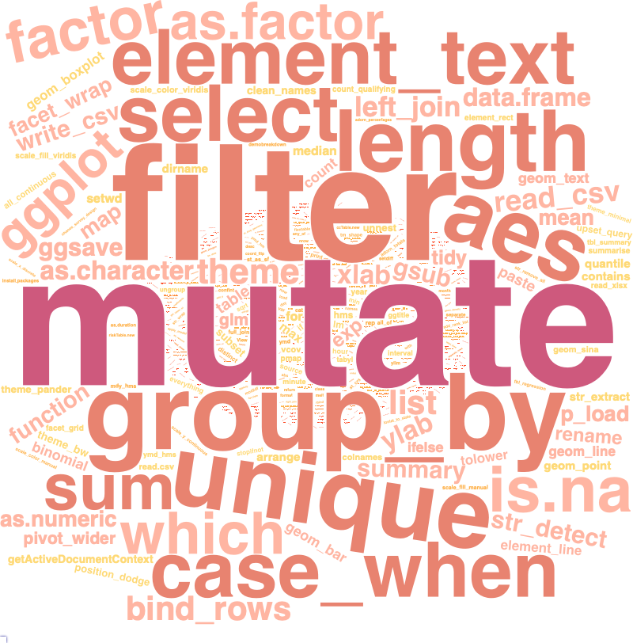

# Function frequencies

I've been coding in R for 6+ years and while I learn something new basically every day, I know there's a small subset (ha) of functions that I lean on really heavily. My hypothesis was that my top used functions would be `tidyverse` functions, specifically `dplyr` functions -- when I get stuck with something complex I tend to simplify and go back to a good ol' `group_by() %>% summarize()` 

Unsuprisingly, `group_by()` was in my top 10, but `mutate` took the top spot -- pretty indicative of my preference for data cleaning over analysis 😅

